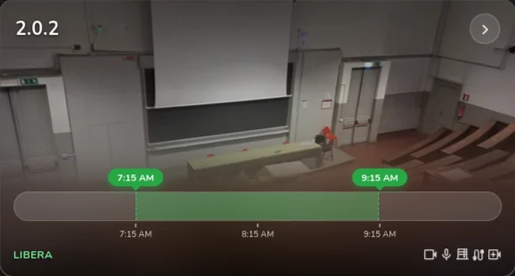
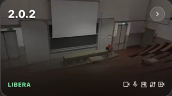

- Rifinite animazioni e transizioni per un'esperienza più fluida
- Ridisegnate le schede delle aule con la foto dell'aula e un layout più moderno
<!-- more -->
La primissima beta dopo il rilascio stabile. Non porta molto, ma porta cose su cui volevo mettere le mani da tempo e che avevo messo da parte per far uscire la 1.0 il prima possibile. Ora che è uscita, posso finalmente concentrarmi su cose a cui forse tengo solo io, come il design della UI!

## Animazioni rifinite
Tutte le animazioni e le transizioni di PoliAule sono state ripulite e rifinite, seguendo [i principi di Emil Kowalski per le animazioni delle interfacce](https://animations.dev/).

## Schede delle aule
Le schede delle aule ora usano la foto dell'aula come sfondo. Tutto il resto è stato adattato a questo nuovo design, con sfumature e sfocature che mantengono il testo leggibile.

Le foto vengono scaricate da un'utility condivisa che le tiene anche in cache, e solo quando la scheda sta per comparire a schermo: niente rallentamenti, niente congestione della rete, e nessun traffico sospetto verso i server del Politecnico.
