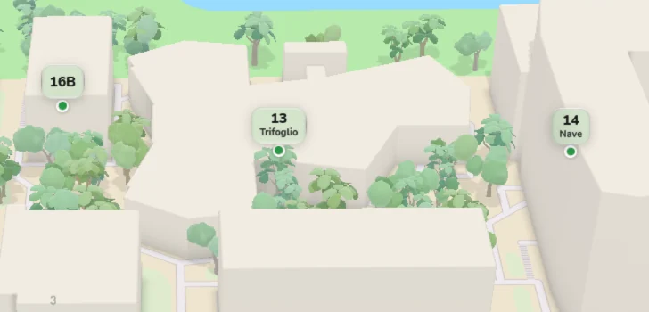
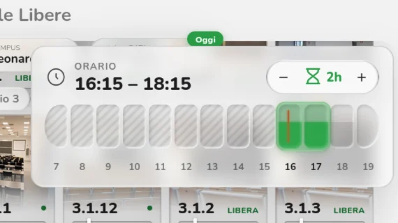
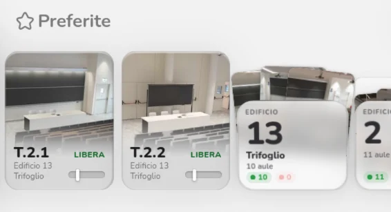
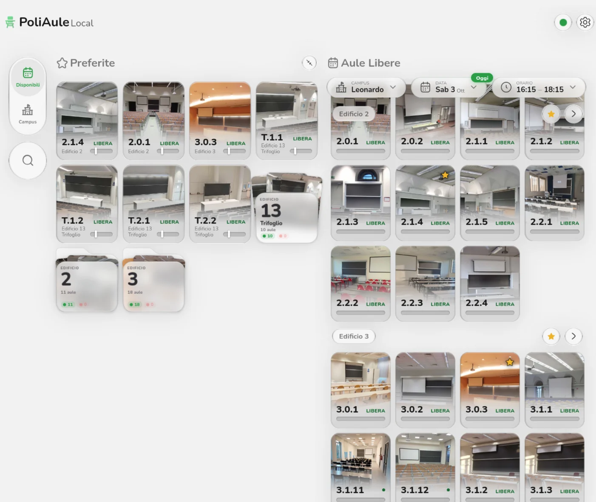
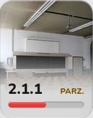
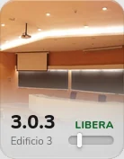
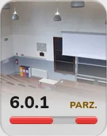
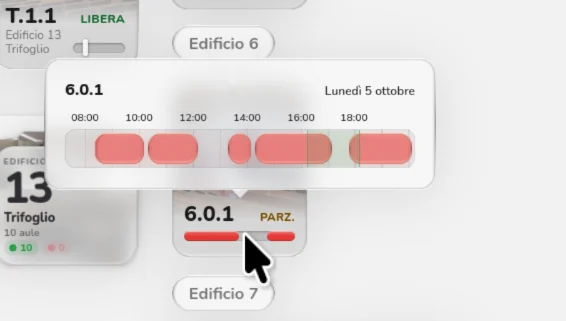

- Ridisegnati gli indicatori della mappa per campus ed edifici
- Ridisegnato il selettore dell'intervallo di tempo nel tab Disponibili
- Aggiunti gli edifici preferiti
- Aggiunto un nuovo layout esteso per i Preferiti nel tab Disponibili
- Guarda l'intera giornata di un'aula passando il mouse sul fondo della sua scheda
- Le schede delle aule ora mostrano la fascia oraria attuale e quella successiva
- Migliorate le prestazioni all'avvio
- Aggiornati i dati per includere tutti i campus, gli edifici e le aule, compresi il campus di Piacenza e molti edifici secondari
- Aggiornati icone e loghi
<!-- more -->
## Indicatori della mappa

Gli indicatori della mappa sono stati ridisegnati da zero. Ora hanno un corpo di vetro trasparente di Vitrium, elegante e pulito sulla mappa colorata di Mapbox, e mostrano anche il nome alternativo dell'edificio, così è più facile riconoscerlo.

Gli edifici principali (quelli con aule) sono verdi, mentre quelli secondari sono di vetro completamente trasparente e un po' più piccoli.

## Selettore dell'intervallo

Il nuovo selettore dell'intervallo si unisce al resto del redesign, costruito con Vitrium per essere moderno e coerente.

Mantiene la sensazione familiare: una barra del tempo orizzontale con una selezione trascinabile sopra. L'interazione è più semplice e pensata per il touch: la selezione ora si aggancia alle ore intere, e il trascinamento (o il nuovo tocco) sposta solo l'intervallo sull'ora scelta. La durata si imposta con uno stepper nell'angolo in alto a destra, così non serve più afferrare il punto esatto per distinguere il ridimensionamento dallo spostamento.

## Preferiti

Ora puoi aggiungere ai preferiti un intero edificio, per avere sottomano tutte le sue aule senza riempire lo schermo di schede singole. Gli edifici stanno insieme alle tue aule preferite, hanno l'aspetto di cartelle e si aprono in un popup con tutte le loro aule.

Su desktop i Preferiti hanno anche un layout esteso: la colonna di sinistra diventa una griglia con i tuoi preferiti, per vederli tutti insieme, e i selettori si spostano in cima alla colonna di destra, fissi come su mobile.

## Un'occhiata alle occupazioni

Le schede delle aule sono state ritoccate per rendere più rapido controllare la giornata di un'aula. Ora mostrano una piccola timeline della fascia oraria attuale e di quella successiva, o della tua ricerca, con lo stato e le occupazioni nel tempo, così capisci a colpo d'occhio se lo stato sta per cambiare.

  

Passando il mouse sul fondo di una scheda si apre un popover con l'intera giornata dell'aula, senza aprire la sua pagina dei dettagli.

## Prestazioni all'avvio

Grazie a un nuovo service worker, PoliAule ora tiene la maggior parte dei suoi file sul tuo dispositivo, quindi la UI è già pronta quando la apri.

Lo stesso vale per i dati: PoliAule riusa i dati che ha già per costruire subito la UI, mentre controlla in background se ci sono aggiornamenti e, se ci sono, aggiorna la UI. L'avvio è molto più veloce, soprattutto con reti lente.

## Dati aggiornati

Una nuova passata sui dati di PoliMaps porta PoliAule da 7 campus, 36 edifici e 307 aule a 14, 154 e 350. Il campus di Piacenza è finalmente qui, insieme a diversi campus secondari, le residenze Casa dello Studente sparse per Milano e tanti edifici secondari nei campus già presenti. Ora sulla mappa compaiono anche le aule riservate agli eventi.

## Nuove icone

Le icone di PoliAule sono state ridisegnate per adattarsi al nuovo stile di vetro.

 
