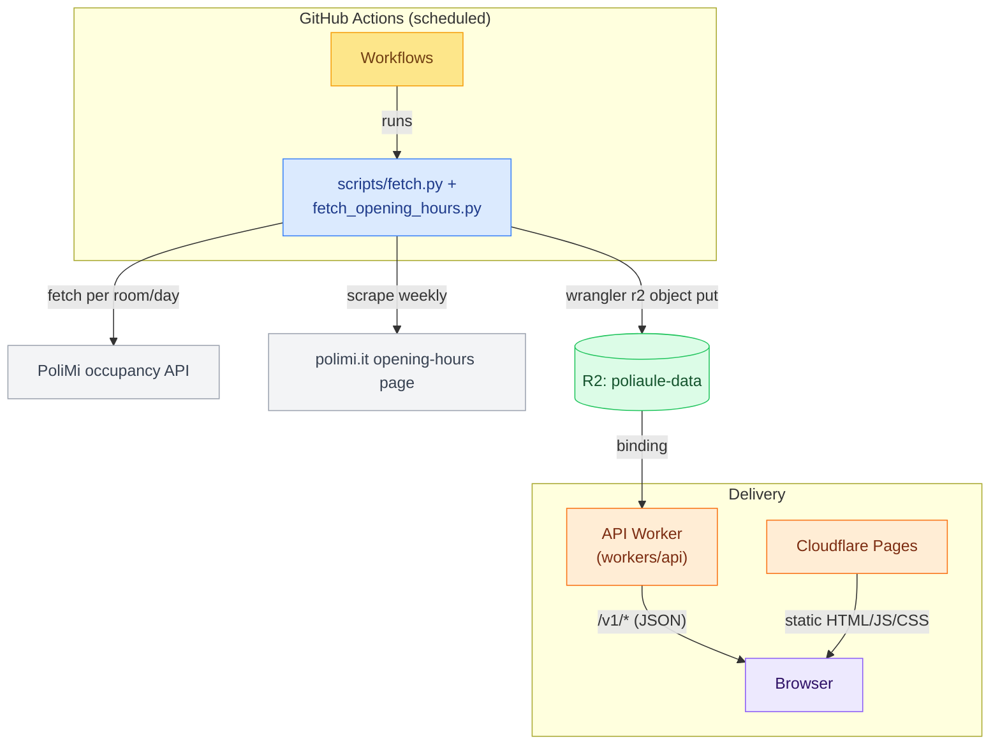
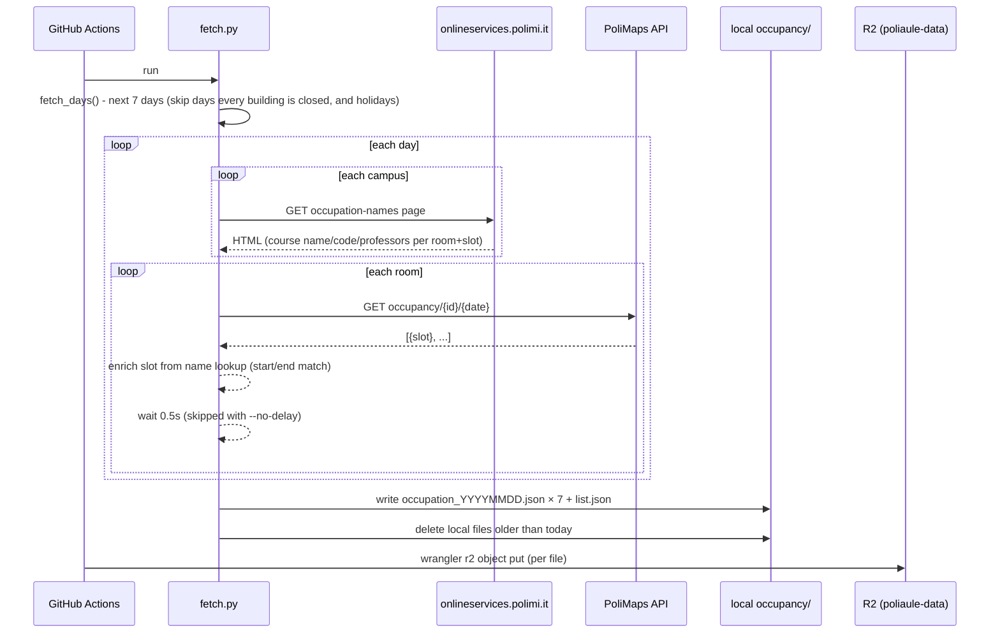
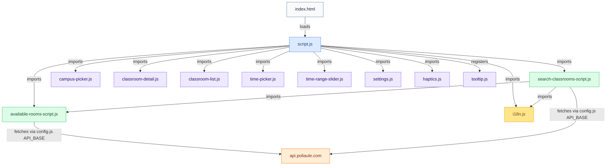
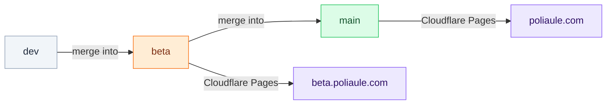

# PoliAule - Architecture

PoliAule's frontend is a static site with no custom server of its own. GitHub Actions fetches occupancy and opening-hours data on a schedule, uploads it to Cloudflare R2, and a Cloudflare Worker (`workers/api`) serves it as a versioned REST API at `api.poliaule.com`. The frontend only ever talks to that API.

---

## System Overview



Both fetch jobs run on GitHub Actions. Both write local JSON, then upload it to the `poliaule-data` R2 bucket via `wrangler r2 object put`. The API Worker binds that bucket and serves it over HTTP; see [api.md](./api.md) for the exact routes.

`fetch.py` reads the freshly-written `data/opening-hours.json` locally to decide which days to fetch. The browser gets it through `/v1/opening-hours` on the API Worker.

---

## Data Pipeline

### fetch.py

Runs on a schedule (and can be triggered manually). For each of the next 7 days it:

1. Reads `data/classrooms.json` to get room IDs.
2. Reads `data/opening-hours.json` to decide which days to fetch: a day is skipped only if every building is closed that weekday, or it falls in a holiday period.
3. For each remaining day, scrapes onlineservices.polimi.it's occupation-names page once per campus (`scripts/fetch_occupation_names.py`, see below) to build a lookup of course name/code/professors by classroom and time slot.
4. GETs the occupancy endpoint for every room on each remaining day, then enriches each returned slot with the matching entry from that lookup, when one exists.
5. Writes one `occupancy/occupation_YYYYMMDD.json` per day locally, mirroring the classrooms structure plus an `occupancy` array of hourly slots, plus `occupancy/list.json`.
6. Deletes stale local files (dates before today).
7. The GitHub Actions workflow uploads all of those files to the `poliaule-data` R2 bucket via `wrangler r2 object put --remote`. A separate R2 lifecycle rule expires occupancy objects a couple of days after they age out of the 7-day window, so nothing needs to explicitly delete stale objects from the bucket.



Rate limiting: 0.5 seconds between calls (skippable via `--no-delay`), 3 retries with 2 seconds backoff on failure. See [Cloudflare Workers & R2](#cloudflare-workers--r2) below for what happens to this data next, including how `beta` gets its copy.

### fetch_occupation_names.py

Called by `fetch.py` (not run standalone in production, though it has its own CLI for manual testing). The REST occupancy endpoint above only returns start/end times, no course name, so this module scrapes onlineservices.polimi.it's server-rendered occupation-names page instead, one request per campus per day, and parses the HTML table directly (no JSON API backs that page).

Each parsed slot's name is then split by `parse_occupation_name()` into structured fields, anchored on the course code (a 5-6 digit number) since dash placement around it is inconsistent and integrated courses have extra dashes inside the course name itself:

- Matches a code → `{category: "COURSE", course, code, professors: [...]}`, plus a `section` field when a `"Sez. A"`-style marker is present. During exam sessions the category is `"EXAM"` instead of `"COURSE"` (same fields): Polimi appends `(ESAME)`/`(ORALI)`/`(ULTIMA PROVA IN ITINERE)` straight onto the last professor's name, which gets stripped out and turned into the category rather than left in `professors`.
- No code found (events, tutoring sessions, maintenance blocks, ...) → `{category: "OTHER", raw}`, keeping the untouched string rather than forcing it into a shape that doesn't fit.

A campus that fails to scrape, or a page that comes back in an unrecognized shape, is skipped with a warning and never blocks the REST-based occupancy fetch: no-name occupancy slots are preferable to failing the whole run over a page layout change.

### fetch_opening_hours.py

Runs weekly (Sunday 6 AM UTC), independent of `fetch.py`'s twice-daily schedule. Scrapes polimi.it's building opening-hours page and writes `data/opening-hours.json`, containing:

- `buildings`: explicit per-building hours, keyed by the building number/code shown on the page (e.g. `"21"`, `"B12"`)
- `campus_defaults`: fallback hours for a whole campus, from the page's "Tutti"/"Tutti gli altri spazi" rows
- `holiday_periods`: closure date ranges parsed from the page's yearly closure announcement
- `default_hours`: last-resort fallback for campuses the page doesn't cover at all (Cremona, Lecco, Mantova)

The page has no JSON/PDF export and can change format without notice, so a parse that looks too small or missing key sections is rejected: the script exits non-zero and leaves the existing `data/opening-hours.json` untouched rather than uploading bad data. The workflow then uploads the resulting file to both `poliaule-data` and `poliaule-data-beta` directly, with no beta-specific gating.

Both `fetch.py` and the frontend resolve a building's hours the same way: an explicit match in `buildings`, else the building's campus in `campus_defaults`, else `default_hours`. `scripts/fetch.py`'s `resolve_building_hours()` and `available-rooms-script.js`'s `resolveBuildingHours()` implement this lookup independently, keyed off the same file, so there's no shared runtime dependency between the Python and JS sides.

### JSON schema (abbreviated)

```
occupation_YYYYMMDD.json
└── date: "YYYY-MM-DD"
└── campuses[]
    └── id, name
    └── buildings[]
        └── id, name
        └── classrooms[]
            └── id, name, features[]
            └── occupancy[]          ← added by fetch.py; each entry is a BOOKED slot
                └── { inizio: "HH:MM", fine: "HH:MM" }
                └── + { category: "COURSE" | "EXAM", course, code, professors[], section? }
                      or { category: "OTHER", raw }, plus idrichiesta
                      ← merged in from fetch_occupation_names.py's scrape, when a match exists
```

`data/classrooms.json` has the same structure minus the `occupancy` field; it's the static source of truth for room metadata, edited by hand and manually re-uploaded to R2 (`wrangler r2 object put`) whenever it changes. No script generates or fetches it.

> Full schema, endpoint paths, and usage examples are in [api.md](./api.md).

---

## Frontend Architecture

> For more detail on routing, navigation, the View Transition API, and PWA support, see [frontend.md](./frontend.md).

The frontend is vanilla ES modules, no build step or framework.



### Key modules

| File | Responsibility |
|---|---|
| `script.js` | App shell: splash screen, tab routing, form wiring, campus picker init |
| `available-rooms-script.js` | Fetches occupancy JSON and opening hours, exposes `findAvailableClassrooms()` |
| `search-classrooms-script.js` | Search tab: full-text index, hierarchy navigation, classroom status |
| `i18n.js` | Locale detection (browser / localStorage), `t()` translation helper |
| `components/campus-picker.js` | Campus selector UI + popup |
| `components/classroom-detail.js` | Classroom detail page with timeline and photo |
| `components/time-picker.js` | Morphing time input |
| `components/time-range-slider.js` | Dual-handle slider for time range |
| `components/settings.js` | User preferences (remembered campus, partial availability, etc.) |
| `components/tooltip.js` | Side-effect module: registers a global `data-tooltip` attribute handler |
| `components/popover.js` | `@floating-ui/dom` wrapper (exported, available for future use) |

### Classroom photos

`scripts/fetch_photos.py` resolves and downloads every classroom's photo from PoliMi once a month, uploads changed ones to R2 under `photos/<classroom_id>.jpg`, and serves them through the API Worker at `GET /v1/photos/:id` (keyed by the classroom's own `id`, not PoliMi's internal `idfoto`). A `photos/manifest.json` (MD5 per classroom) lets the job skip re-uploading and re-purging photos that haven't changed; it's stored in R2 alongside the photos (`photos/manifest.json`), downloaded at the start of each run and re-uploaded at the end once upload+purge succeed. It is not kept in `actions/cache` because GitHub evicts caches untouched for 7 days, which this monthly job would always exceed.

The frontend still loads photos on-demand when a classroom card scrolls into view or a detail page opens (`ClassroomDetail._loadPhoto()`, `utils/photo.js`'s `fetchPhotoUrl()`), but now that's just building a URL against our own API instead of calling PoliMi directly — the response is edge- and browser-cacheable for 30 days (`Cache-Control: public, max-age=2592000, immutable`), matching the fetch cadence.

### Localization

`i18n.js` detects locale from `localStorage` → `navigator.language` → `'en'` fallback. Supported: `en`, `it`. Translation files live in `locales/en.json` and `locales/it.json`. The `t(key)` helper is called by virtually every component.

---

## Deployment

PoliAule is hosted on **Cloudflare Pages** across two branches, each mapped to its own custom domain:

| Branch | Domain | Purpose |
|---|---|---|
| `main` | `poliaule.com` | Production |
| `beta` | `beta.poliaule.com` | Staging / preview |

Development happens on `dev`, which gets merged into `beta` for testing and then into `main` for release.



### Cloudflare Workers & R2

Two R2 buckets hold the fetched data: `poliaule-data` (prod) and `poliaule-data-beta` (beta). `workers/api` (a Hono app) binds one bucket per environment and serves it as the versioned REST API described in [api.md](./api.md), deployed as `poliaule-api` / `poliaule-api-beta`, on custom domains `api.poliaule.com` / `api-beta.poliaule.com`. It also caches responses at Cloudflare's edge (`caches.default`) so repeat requests for the same URL don't hit R2 at all.

`config.js` holds the `API_BASE` the frontend fetches from; `scripts/build-beta.sh` overwrites it to point at `api-beta.poliaule.com` for the beta Pages build.

### Keeping beta in sync

Beta's occupancy data isn't independently fetched from PoliMi by default. After the GitHub Actions workflow fetches once for prod, it checks the `BETA_OCCUPANCY_BACKEND_ENABLED` GitHub Actions repository variable:

- **Off (default):** the same files just fetched for `poliaule-data` are re-uploaded to `poliaule-data-beta` as-is, with no second PoliMi request.
- **On:** the workflow additionally checks out the `beta` branch's own copy of `scripts/fetch.py` and runs it as a second pass against PoliMi, uploading its output to `poliaule-data-beta` instead. This is for testing new fetch/transform logic in isolation before merging it into `main`.

Opening hours has no such flag: it always uploads the same fetched output to both buckets.

The app detects its environment from `location.hostname` at startup and shows a badge for `beta.poliaule.com` and local dev.

---

## External Dependencies (CDN)

| Library | Used for |
|---|---|
| `@floating-ui/dom` | Popover positioning |
| `web-haptics` | Mobile vibration feedback |
| Google Fonts (Nunito) | Typography |
| Google Material Symbols | Icons |
