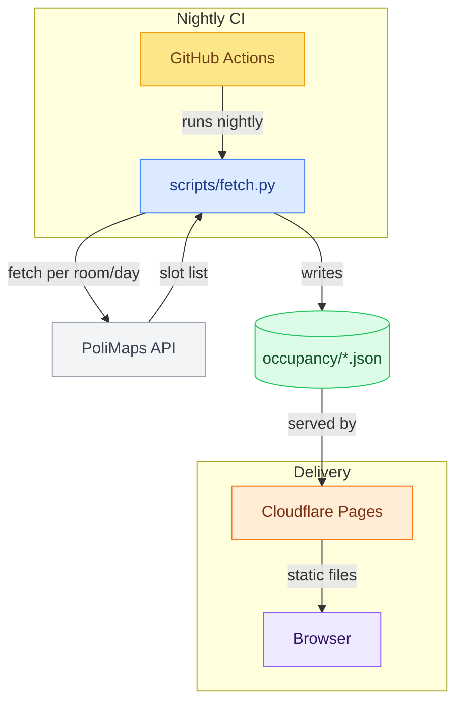
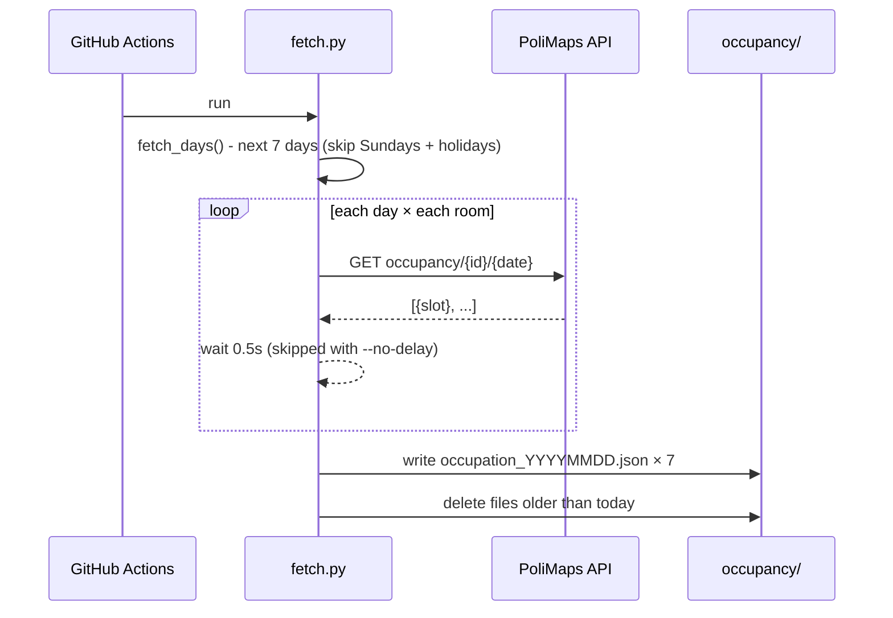
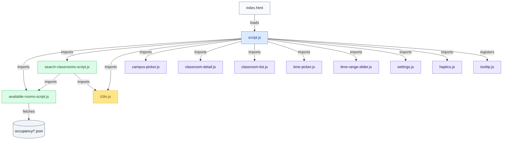
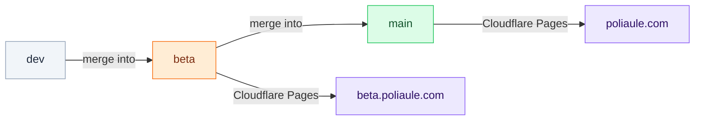

# PoliAule - Architecture

PoliAule is a static web app that finds available classrooms at Politecnico di Milano. It has no custom server: a GitHub Actions job pre-fetches occupancy data nightly, the frontend reads those JSON files directly through the built-in REST API.

---

## System Overview



Data never passes through a custom backend. The browser fetches occupancy JSON files the same way it fetches any static asset.

---

## Data Pipeline

### fetch.py

Runs on a schedule (and can be triggered manually). For each of the next 7 non-Sunday, non-holiday days it:

1. Reads `data/classrooms.json` to get room IDs.
2. GETs the occupancy endpoint for every room on each day.
3. Writes one `occupancy/occupation_YYYYMMDD.json` per day, mirroring the classrooms structure plus an `occupancy` array of hourly slots.
4. Deletes stale files (dates before today).



Rate limiting: 0.5 seconds between calls (skippable via `--no-delay`), 3 retries with 2 seconds backoff on failure.

### JSON schema (abbreviated)

```
occupation_YYYYMMDD.json
└── date: "YYYY-MM-DD"
└── campuses[]
    └── id, name
    └── buildings[]
        └── id, name
        └── classrooms[]
            └── id, name, features[]
            └── occupancy[]          ← added by fetch.py; each entry is a BOOKED slot
                └── { inizio: "HH:MM", fine: "HH:MM" }
```

`data/classrooms.json` has the same structure minus the `occupancy` field; it's the static source of truth for room metadata. 

> Full schema and usage examples are in [api.md](./api.md).

---

## Frontend Architecture

> For more detail on routing, navigation, the View Transition API, and PWA support, see [frontend.md](./frontend.md).

The frontend is vanilla ES modules, no build step or framework.



### Key modules

| File | Responsibility |
|---|---|
| `script.js` | App shell: splash screen, tab routing, form wiring, campus picker init |
| `available-rooms-script.js` | Fetches occupancy JSON, exposes `findAvailableClassrooms()` |
| `search-classrooms-script.js` | Search tab: full-text index, hierarchy navigation, classroom status |
| `i18n.js` | Locale detection (browser / localStorage), `t()` translation helper |
| `components/campus-picker.js` | Campus selector UI + popup |
| `components/classroom-detail.js` | Classroom detail page with timeline and photo |
| `components/time-picker.js` | Morphing time input |
| `components/time-range-slider.js` | Dual-handle slider for time range |
| `components/settings.js` | User preferences (remembered campus, partial availability, etc.) |
| `components/tooltip.js` | Side-effect module: registers a global `data-tooltip` attribute handler |
| `components/popover.js` | `@floating-ui/dom` wrapper (exported, available for future use) |

### Classroom photos

Classroom photos are fetched on-demand when the user opens a detail page, not at startup. If the classroom has an `idfoto` field in the data, `ClassroomDetail._loadPhoto()` fires a single request at that point. Nothing is preloaded or cached beyond the browser's own HTTP cache.

### Localization

`i18n.js` detects locale from `localStorage` → `navigator.language` → `'en'` fallback. Supported: `en`, `it`. Translation files live in `locales/en.json` and `locales/it.json`. The `t(key)` helper is called by virtually every component.

---

## Deployment

PoliAule is hosted on **Cloudflare Pages** across two branches, each mapped to its own custom domain:

| Branch | Domain | Purpose |
|---|---|---|
| `main` | `poliaule.com` | Production |
| `beta` | `beta.poliaule.com` | Staging / preview |

Development happens on `dev`, which gets merged into `beta` for testing and then into `main` for release.



### Keeping beta in sync

After the nightly fetch commits new occupancy data to `main`, the Actions workflow checks out `beta` and merges `main` into it. That way `beta.poliaule.com` always serves fresh data, even when no code changes are in flight.

The app detects its environment from `location.hostname` at startup and shows a badge for `beta.poliaule.com` and local dev.

---

## External Dependencies (CDN)

| Library | Used for |
|---|---|
| `@floating-ui/dom` | Popover positioning |
| `web-haptics` | Mobile vibration feedback |
| Google Fonts (Nunito) | Typography |
| Google Material Symbols | Icons |
