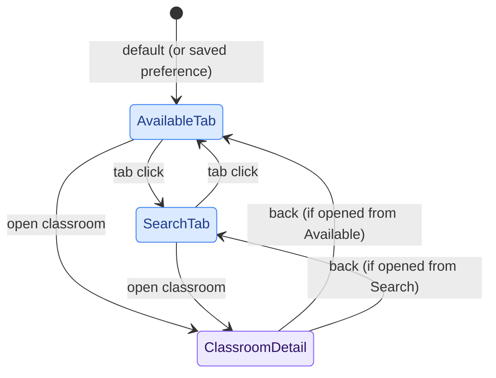
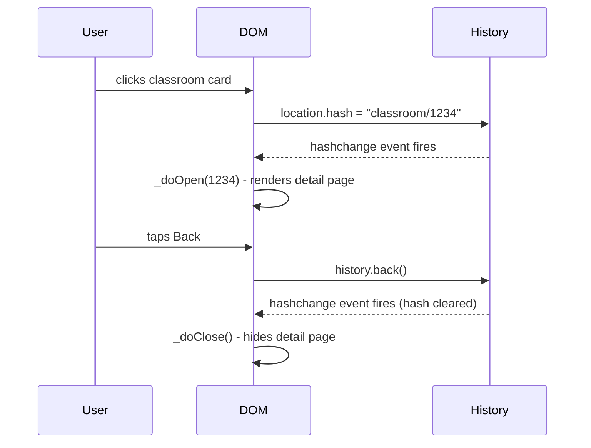

# PoliAule - Frontend

The frontend is plain HTML + vanilla ES modules, no framework. Cloudflare Pages builds it with Vite (`npm run build`), which bundles and minifies the JS/CSS graph reachable from `index.html` into hashed files under `dist/assets/`. Static files referenced by absolute path at runtime rather than imported (`public/favicons/`, `public/fonts/`, `public/locales/`, `public/images/`) are copied through unprocessed via Vite's `public/` convention. Build commands: `npm run dev`, `npm run build`, `npm run lint`.

---

## Tab Navigation

The main UI is divided into two tabs (Available and Campus) plus a Search overlay and a Settings panel. The tab bar is Vitrium's `createTabBar` (`components/bottom-nav.js`): a bottom row on mobile and a side rail from 600px up. Tab switching is CSS-driven: selecting a tab adds/removes a `visible` class on the corresponding `.tab-content` container. Search is a `prominent` + `press` tab: a floating circle that never becomes selected and opens the search overlay, which morphs out of it. No URL change happens: tab state is purely in-memory, with an optional preference stored in `localStorage` so the user's last-used tab (or a fixed default) survives page reloads.

The sliding selection pill, its drag behaviour and the row/rail layout change are all Vitrium's tab bar (spring-driven, no separate animation library).

---

## Classroom Detail - Hash Routing

Opening a classroom pushes a URL hash (`#classroom/{id}`) and triggers a `hashchange` event. Closing restores the previous state. This means:

- The browser's back button works as expected (closes the detail page).
- Deep links and browser history are handled for free.
- No client-side router library is needed.

If the detail page was opened programmatically (e.g., a direct link load), `history.replaceState` is used instead to avoid adding a spurious back-stack entry.

---

## View Transition API

Classroom open/close is animated with the [View Transition API](https://developer.mozilla.org/en-US/docs/Web/API/View_Transitions_API) (`document.startViewTransition`). The browser snapshots the current state, applies the DOM change, and crossfades, with named elements morphing between their old and new positions.

Named transitions used:

| `view-transition-name` | Old state | New state |
|---|---|---|
| `classroom-nav` | Tab bar | Back button |
| `classroom-detail-name` | Classroom name in card | Title in detail page |
| `classroom-status` | Status badge in card | Status badge in header |

The names are assigned immediately before `startViewTransition()` and cleared once `vt.finished` resolves, so they never accidentally affect unrelated elements.

On browsers that don't support the API, open/close still works: the `if (document.startViewTransition)` guard falls back to a plain CSS class toggle.

The photo reveal is deliberately delayed until `vt.finished` to avoid a flicker: if the image decodes before the VT pseudo-elements are torn down, showing it mid-transition causes a visible flicker, especially in Safari.

---

## Splash Screen

At startup, a full-screen splash overlay shows the app logo centred on screen. Once data is loaded, the logo animates into its position in the header and the overlay fades out. The real header logo is hidden (`opacity: 0`) while this happens, so the two appear to be one continuous motion.

---

## PWA Support

PoliAule includes a [Web App Manifest](https://developer.mozilla.org/en-US/docs/Web/Manifest) (`/favicons/site.webmanifest`) and can be installed as a standalone app on any platform that supports PWAs.

Manifest highlights:

| Field | Value |
|---|---|
| `display` | `standalone` (no browser chrome when installed) |
| `theme_color` | `#2a9e47` (brand green, light-mode accent) |
| `background_color` | `#ffffff` |
| Icons | 192×192 and 512×512 maskable PNGs |

Dark mode is handled via CSS `prefers-color-scheme` media queries. The `theme-color` meta tag uses two separate `<meta>` elements, one per scheme, so the OS chrome color matches the current mode.

There is no service worker, so the app does not work offline. All data is fetched fresh from Cloudflare Pages on every visit.

---

## Localization

`i18n.js` is a lightweight module that loads a locale JSON file on startup and exposes a `t(key)` helper used by virtually every component.

Locale resolution order:

1. `localStorage` (user's explicit choice)
2. `navigator.language` (browser preference)
3. `'en'` (fallback)

Supported locales: `en`, `it` (`locales/en.json`, `locales/it.json`).

Language switches at runtime trigger `onLanguageSwitch` callbacks registered by components, which re-render their translated strings in place.

---

## User Preferences

User preferences are managed by `components/settings.js` and stored in `localStorage`. This includes things like the preferred campus, the default or last-used tab, and whether to show partially available classrooms.

Because `localStorage` is scoped to the browser on a single device, preferences are not synced across devices. Switching from your laptop to your phone means starting from defaults again.

---

## UI components (Vitrium)

The glass design system and most interactive components come from the `vitrium` package, extracted from this app. `style.css` starts with `@import "vitrium/styles"`, and components are imported from `'vitrium'`.

| Area | Built on |
|---|---|
| Tokens, glass, blur, springs, press/drag deform | `vitrium/styles`, `initLiquidGlass`, and the blur-capability helpers, set up in `script.js` |
| Settings toggles and segmented controls | `createToggle`, `createSegmentedControl` |
| Footer version popover, classroom timeline popover | `createPopover` |
| Date and time-range chips | `createChipPicker` via `components/chip-shell.js` |
| Campus picker (Available tab and campus sheet) | `createListPicker` |
| Data-fetch card | `createMorphPopup` |
| Campus sheet | `createSheet` |
| Main navigation | `createTabBar` |

Things to know:

- **Docked pickers.** (PoliAule-side workaround: Vitrium has no docked mode.) On wide screens `picker-dock.js` docks the campus, date and time pickers open as inline cards. Vitrium has no docked mode, so `chip-shell.js` swaps the chip for a card (rebuilding the chip when undocked), and `campus-picker.js` moves the list's own panel into the form column.
- **Tab bar rebuilds.** Vitrium rebuilds tab buttons when the layout changes, and the Search circle is a new element each time, so the search overlay finds it by class (`.lg-tabbar__prominent`), never by id or a held reference. Labels are only known after startup, so `bottom-nav.js` sets them with `setLabel` (via `retranslateNav`, which `script.js` calls once i18n is ready).
- **Page padding follows the bar.** `.tab-content`, `.body-container`, `.footer` and the favourites carousel's `--fade-left` transition their padding (`--nav-shift` in `style.css`) when the bar moves between row and rail. `--side-nav-width` and `--bottom-nav-height` are only updated while the bar is in the matching layout, so the padding never chases a mid-move measurement.
- **Campus sheet corners.** On mobile the collapsed sheet is concentric with the tab bar, using the bar's settled height and inset; the sheet is rebuilt (same detent, scroll and content) when the breakpoint or those metrics change. Its squash/stretch is limited to drags that start on the grabber or header (`deform: 'handle'`), so dragging over the building cards doesn't stretch it.
- **Fonts and icons.** The tab and chip icons are HugeIcons glyphs passed as HTML where Vitrium expects SVG, so `bottom-nav.css` and `chip-pickers.css` size them.

---

## Tooltip

`components/tooltip.js` is imported as a pure side-effect (`import './components/tooltip.js'`). It registers global `mouseenter`/`mouseleave` listeners that show a floating label for any element with a `data-tooltip` attribute.

---

## Security

### XSS prevention

The frontend builds HTML by interpolating API data into template literals and assigning the result to `element.innerHTML`. If any value contains `<`, `>`, `"`, or `&`, the browser would parse it as markup - a Cross-Site Scripting (XSS) vulnerability if the data ever comes from a compromised upstream source.

All external data is sanitized through `utils/html.js` before touching `innerHTML`:

| Helper | Purpose |
|---|---|
| `escapeHtml(str)` | Replaces `& < > " '` with their HTML entity equivalents. Use on every string field from API responses or JSON files when building an HTML template. |
| `safeUrl(url)` | Allows only `https:` URLs; returns `'#'` for anything else. Use for `href` and `src` attributes sourced from external data, to block `javascript:` URL injection. |

**Rule:** any new `innerHTML` template that interpolates a field from an API response or a JSON file must wrap each string value in `escapeHtml()`, and any URL value in `safeUrl()`.

The following do **not** need escaping:
- `t()` calls - strings come from our own translation tables.
- Numbers after `.toLocaleString()` / `.toFixed()` - numeric output contains no markup.
- Icon names and class names from local constant maps (`FEATURE_ICONS`, `LANG_COLORS`), keyed on trusted integer IDs or hardcoded strings.

### Classroom photo URL validation

Classroom photos require two requests: the first fetches a URL from the Polimi API; the second is made implicitly by the browser when that URL is assigned to `img.src`. To prevent a compromised API response from redirecting the browser to an arbitrary third-party server (client-side SSRF), `_loadPhoto()` in `classroom-detail.js` validates the extracted URL before use:

- Hostname must be exactly `docmanager.polimi.it`.
- Protocol must be `https:`.

Any URL that fails this check causes the photo container to be removed silently, as if no photo existed.

---

## Module Summary

| File | Role |
|---|---|
| `script.js` | App shell: splash, tab bar, form wiring, startup preferences |
| `available-rooms-script.js` | Data fetch, `findAvailableClassrooms()` filtering |
| `classroom-search-data.js` | Full-text search index, hierarchy navigation |
| `i18n.js` | Locale loading, `t()`, language switch callbacks |
| `components/campus-picker.js` | `<campus-chip-picker>`: Vitrium list picker, `campuschange` event, docked mode |
| `components/chip-shell.js` | Shared shell of the date and time chip pickers (Vitrium chip, docked mode) |
| `components/date-chip-picker.js`, `components/time-range-chip-picker.js` | Custom elements wrapping the date row and the time slider |
| `components/bottom-nav.js` | Main navigation on Vitrium's tab bar |
| `components/campus-sheet.js` | Campus map sheet on Vitrium's sheet |
| `components/data-fetch-card.js` | Header status card on Vitrium's morph popup |
| `components/classroom-detail.js` | Detail sheet with hash routing, VT animations, photo, schedule |
| `components/classroom-list.js` | Renders classroom cards in the Available tab |
| `components/time-picker.js` | Morphing time input |
| `components/time-range-slider.js` | Dual-handle time range slider |
| `components/settings.js` | User preferences panel + `localStorage` keys |
| `components/tooltip.js` | Side-effect: global `data-tooltip` handler |
| `utils/time-format.js` | `createTimeFormatter()`, locale-aware time display |
| `utils/html.js` | `escapeHtml()` and `safeUrl()` - XSS sanitization helpers |
