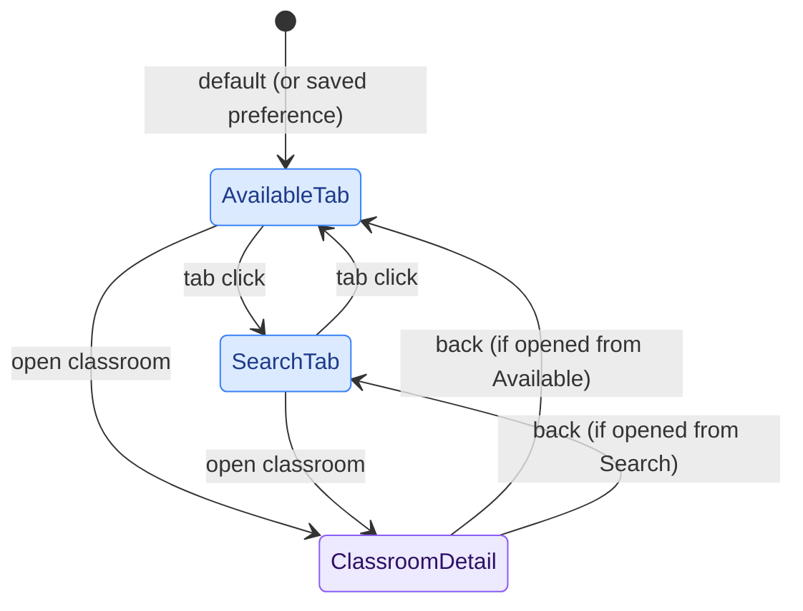
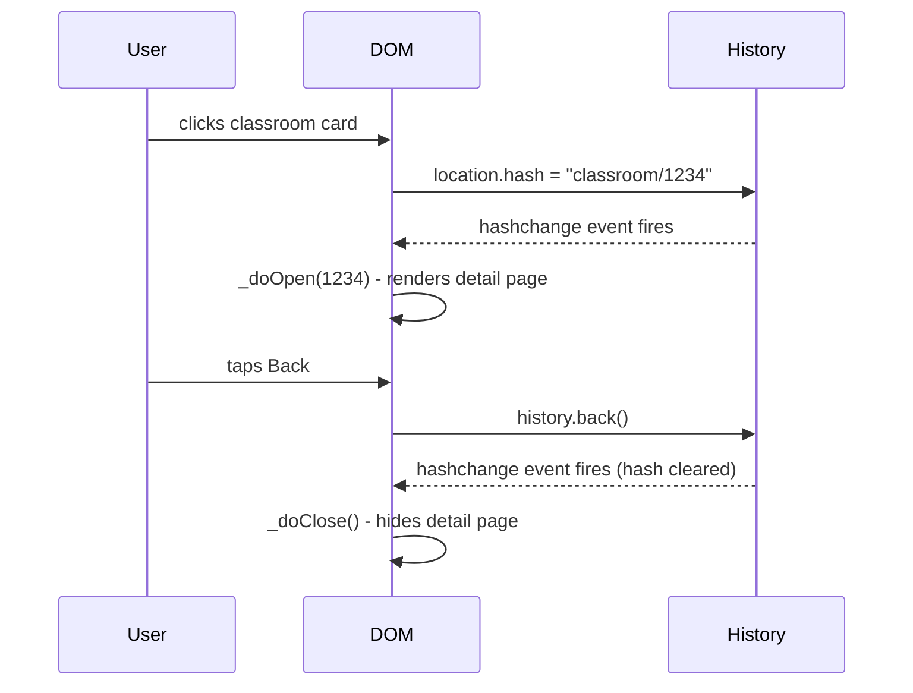

# PoliAule - Frontend

The frontend is plain HTML + vanilla ES modules. No build step, no framework, no bundler: files are served directly by Cloudflare Pages.

---

## Tab Navigation

The main UI is divided into two tabs (Available and Search) plus a Settings panel. Tab switching is CSS-driven: clicking a tab adds/removes a `visible` class on the corresponding `.tab-content` container. No URL change happens: tab state is purely in-memory, with an optional preference stored in `localStorage` so the user's last-used tab (or a fixed default) survives page reloads.

The animated sliding indicator under the tab bar is a single `
` moved with `translateX`. No JS animation library needed.

---

## Classroom Detail — Hash Routing

Opening a classroom pushes a URL hash (`#classroom/{id}`) and triggers a `hashchange` event. Closing restores the previous state. This means:

- The browser's back button works as expected (closes the detail page).
- Deep links and browser history are handled for free.
- No client-side router library is needed.

If the detail page was opened programmatically (e.g., a direct link load), `history.replaceState` is used instead to avoid adding a spurious back-stack entry.

---

## View Transition API

Classroom open/close is animated with the [View Transition API](https://developer.mozilla.org/en-US/docs/Web/API/View_Transitions_API) (`document.startViewTransition`). The browser snapshots the current state, applies the DOM change, and crossfades, with named elements morphing between their old and new positions.

Named transitions used:

| `view-transition-name` | Old state | New state |
|---|---|---|
| `classroom-nav` | Tab bar | Back button |
| `classroom-detail-name` | Classroom name in card | Title in detail page |
| `classroom-status` | Status badge in card | Status badge in header |

The names are assigned immediately before `startViewTransition()` and cleared once `vt.finished` resolves, so they never accidentally affect unrelated elements.

On browsers that don't support the API, open/close still works: the `if (document.startViewTransition)` guard falls back to a plain CSS class toggle.

The photo reveal is deliberately delayed until `vt.finished` to avoid a flicker: if the image decodes before the VT pseudo-elements are torn down, showing it mid-transition causes a visible flicker, especially in Safari.

---

## Splash Screen

At startup, a full-screen splash overlay shows the app logo centred on screen. Once data is loaded, the logo animates into its position in the header and the overlay fades out. The real header logo is hidden (`opacity: 0`) while this happens, so the two appear to be one continuous motion.

---

## PWA Support

PoliAule includes a [Web App Manifest](https://developer.mozilla.org/en-US/docs/Web/Manifest) (`/favicons/site.webmanifest`) and can be installed as a standalone app on any platform that supports PWAs.

Manifest highlights:

| Field | Value |
|---|---|
| `display` | `standalone` (no browser chrome when installed) |
| `theme_color` | `#2a9e47` (brand green, light-mode accent) |
| `background_color` | `#ffffff` |
| Icons | 192×192 and 512×512 maskable PNGs |

Dark mode is handled via CSS `prefers-color-scheme` media queries. The `theme-color` meta tag uses two separate `<meta>` elements, one per scheme, so the OS chrome color matches the current mode.

There is no service worker, so the app does not work offline. All data is fetched fresh from Cloudflare Pages on every visit.

---

## Localization

`i18n.js` is a lightweight module that loads a locale JSON file on startup and exposes a `t(key)` helper used by virtually every component.

Locale resolution order:

1. `localStorage` (user's explicit choice)
2. `navigator.language` (browser preference)
3. `'en'` (fallback)

Supported locales: `en`, `it` (`locales/en.json`, `locales/it.json`).

Language switches at runtime trigger `onLanguageSwitch` callbacks registered by components, which re-render their translated strings in place.

---

## User Preferences

User preferences are managed by `components/settings.js` and stored in `localStorage`. This includes things like the preferred campus, the default or last-used tab, and whether to show partially available classrooms.

Because `localStorage` is scoped to the browser on a single device, preferences are not synced across devices. Switching from your laptop to your phone means starting from defaults again.

---

## Haptics

`components/haptics.js` wraps the `web-haptics` CDN library. Components call `haptics.trigger(pattern)` on significant interactions (tab switches, opening a classroom, form submission). On devices without haptic support the call is a no-op.

---

## Tooltip

`components/tooltip.js` is imported as a pure side-effect (`import './components/tooltip.js'`). It registers global `mouseenter`/`mouseleave` listeners that show a floating label for any element with a `data-tooltip` attribute.

---

## Module Summary

| File | Role |
|---|---|
| `script.js` | App shell: splash, tab bar, form wiring, startup preferences |
| `available-rooms-script.js` | Data fetch, `findAvailableClassrooms()` filtering |
| `search-classrooms-script.js` | Full-text search index, hierarchy navigation |
| `i18n.js` | Locale loading, `t()`, language switch callbacks |
| `components/campus-picker.js` | Campus selector popup |
| `components/classroom-detail.js` | Detail sheet with hash routing, VT animations, photo, schedule |
| `components/classroom-list.js` | Renders classroom cards in the Available tab |
| `components/time-picker.js` | Morphing time input |
| `components/time-range-slider.js` | Dual-handle time range slider |
| `components/settings.js` | User preferences panel + `localStorage` keys |
| `components/haptics.js` | Haptic feedback wrapper |
| `components/tooltip.js` | Side-effect: global `data-tooltip` handler |
| `components/popover.js` | `@floating-ui/dom` wrapper (available, not yet wired in) |
| `utils/time-format.js` | `createTimeFormatter()`, locale-aware time display |
