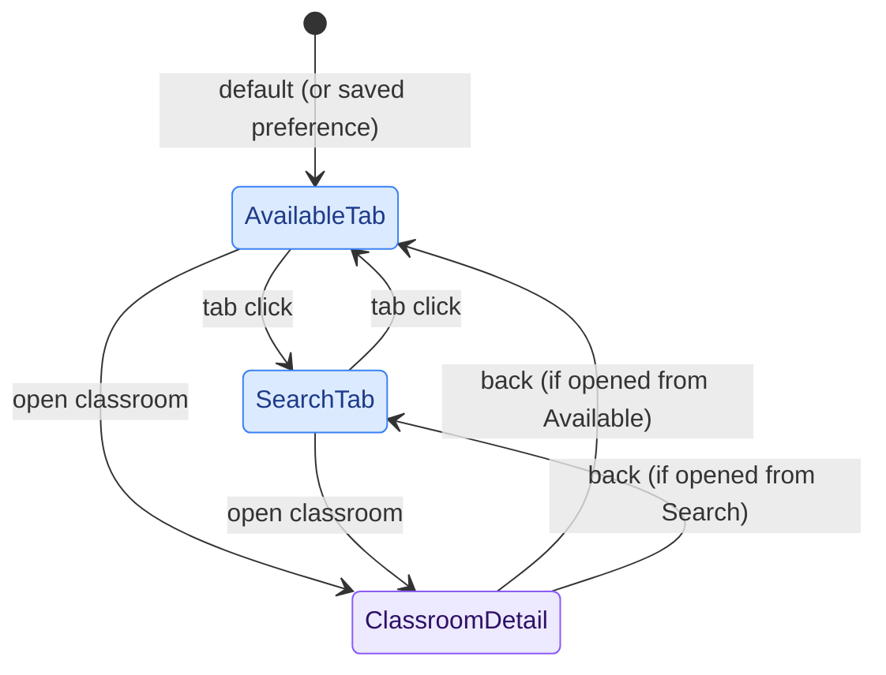
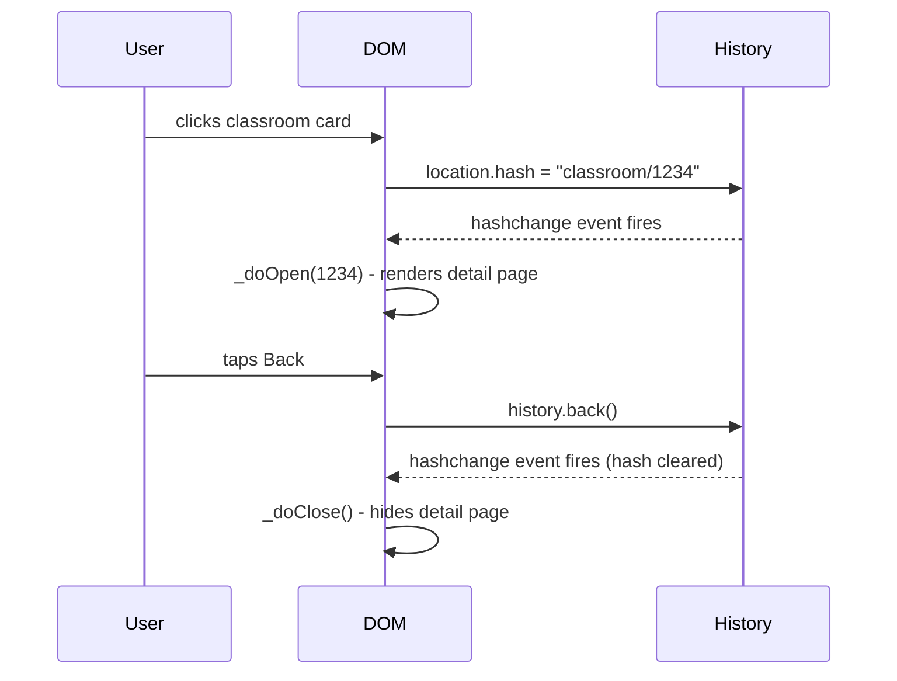

# PoliAule - Frontend

The frontend is plain HTML + vanilla ES modules, no framework. Cloudflare Pages builds it with Vite (`npm run build`), which bundles and minifies the JS/CSS graph reachable from `index.html` into hashed files under `dist/assets/`. Static files referenced by absolute path at runtime rather than imported (`public/favicons/`, `public/fonts/`, `public/locales/`, `public/assets/`) are copied through unprocessed via Vite's `public/` convention. See the "Development Commands" section of the root `CLAUDE.md` for the exact build commands.

---

## Tab Navigation

The main UI is divided into two tabs (Available and Campus) plus a Search overlay and a Settings panel. The tab bar is Vitrium's `createTabBar` (`components/bottom-nav.js`): a bottom row on mobile and a side rail from 600px up. Tab switching is CSS-driven: selecting a tab adds/removes a `visible` class on the corresponding `.tab-content` container. Search is a `prominent` + `press` tab: a floating circle that never becomes selected and opens the search overlay, which morphs out of it. No URL change happens: tab state is purely in-memory, with an optional preference stored in `localStorage` so the user's last-used tab (or a fixed default) survives page reloads.

The sliding selection pill, its drag behaviour and the row/rail layout change are all Vitrium's tab bar (spring-driven, no separate animation library).

---

## Classroom Detail - Hash Routing

Opening a classroom pushes a URL hash (`#classroom/{id}`) and triggers a `hashchange` event. Closing restores the previous state. This means:

- The browser's back button works as expected (closes the detail page).
- Deep links and browser history are handled for free.
- No client-side router library is needed.

If the detail page was opened programmatically (e.g., a direct link load), `history.replaceState` is used instead to avoid adding a spurious back-stack entry.

---

## View Transition API

Classroom open/close is animated with the [View Transition API](https://developer.mozilla.org/en-US/docs/Web/API/View_Transitions_API) (`document.startViewTransition`). The browser snapshots the current state, applies the DOM change, and then animates between the two — by default a cross-fade, plus a morph for every element that carries the same `view-transition-name` on both sides.

### The card → page zoom

The card→page transition is a recreation of SwiftUI's `.zoom` navigation transition, and is built out of two pieces (`utils/vt-motion.js` + the `detail-vt-*` rules in `components/classroom-detail.css`):

1. **The page surface.** The detail page is the *root* snapshot, which the browser always captures at exactly viewport size. `::view-transition-new(root)` (on close, `-old(root)`) is scaled down until its width matches the card's, translated so its top-left corner sits on the card's, and `clip-path`-ed to the card's rounded box — then it springs out to fill the screen. Because the hero photo is full-bleed and starts at the very top of the page, that one transform is also what lands the photo on the card. The screen behind it does not animate at all: it is covered, then uncovered, the way iOS pushes a zoomed view over its source.
2. **The hero.** The card and the page's hero photo share one `view-transition-name` (`detail-hero`) and morph into each other on top of that growing box, with the corner radius interpolating with them. Both snapshots are `object-fit: cover`, so they are crops of the same photo rather than two stretched rectangles, and the outgoing one dissolves over an opaque incoming one in the first fifth of the transition (~80ms), while the box is small and moving fastest.
3. **The arc.** A straight line from the card to the page reads as a slide; the zoom sweeps, and it sweeps *under* the straight line. The horizontal runs ahead of the spring (a time-compressed copy of it) while the vertical drags behind it (the spring raised to a power), so the box swings out and stays low, then rises into place at the end. Both parts are back to zero when the spring lands. It is one `translate` animation, applied identically to the page snapshot and to the hero's image pair — individual transform properties compose outside `transform`, so the offset is in screen pixels for both and the two layers stay registered to the pixel. Closing is not that played backwards: the spring is front-loaded in both directions, so reversing in time would put the bulge of the curve at the wrong end of the journey. `detail-zoom-arc-back` is the same offset expressed against *how far along the straight line the box is*, which is what makes the two directions trace one path through space.

Rooms with no photo get **no** page-side hero, and that is the fix rather than the gap. Step 2 has nothing to pair the card with on such a page, and every stand-in is worse than none: the card's snapshot is `object-fit: cover`-ed into whatever box the morph lands on, so a stand-in the size of its box blows the card up by that box's scale. An empty viewport-sized one — what this used to do — scaled a 152×193 card to 390×844 and swept a 4.4× blow-up of its own text across the screen, which is what "the animation is broken without a photo" looked like. A fake hero the size of a real one is smaller but has the same problem, and it puts an empty grey block at the top of a page that is meant to start at its title.

So on a photo-less room neither end is named: not the page, and not the card either. The card stays in the list's snapshot, which does not move, and step 1 does the whole morph — the page's box starts out exactly covering the card and grows from there, so the card is never visible during the transition at all. Naming the card alone was the first attempt and it ghosted: its snapshot rode on top of the growing page at its own unscaled size, so for the length of the fade you saw the card's title over the page's title, the same words at two sizes. The close is gated the same way, or the ghost just plays backwards. This is also what SwiftUI's `.zoom` does with nothing to pair up: the source view simply becomes the destination page.

The `:only-child` rules in `classroom-detail.css` are now a safety net rather than that path — if a hero ever goes missing between the two snapshots, a half-empty group still fades instead of popping.

The geometry lives in `--zoom-x/-y/-scale/-clip/-radius` and `--arc-x/-y` on `<html>`, written just before the transition starts; the motion is a critically damped spring (`--vt-spring`) over `--vt-duration` (0.4s) in CSS, so no JavaScript runs per frame. Nothing is filtered and nothing larger than the viewport is captured, which is what keeps it cheap on mobile.

Two things deliberately happen *after* `vt.finished` rather than during the transition:

- **The map.** Booting Mapbox (token, script parse, WebGL context, first tiles) is by far the most expensive thing on the detail page — about 1.3s of main-thread work — and doing it inside the update callback is what made the first open of a session stutter. `_scheduleMapEmbed()` waits for the map section to come within 600px of the viewport, for the transition to be over, and then 600ms longer before taking an idle slot. That last wait matters most on a room with *no photo*: its page is short enough that the map section is already in range when it opens, so "after the transition" alone put the boot on top of the page's own entrance animations and made photo-less rooms feel janky when rooms with a photo — whose maps are far below the fold — felt fine. A reader who never scrolls that far never loads Mapbox at all. The Campus tab defers the same boot the same way — `deferredBoot()` in `campus-map.js` waits out that tab's own 0.3s entrance before taking an idle slot, since it is the same second of main-thread work landing in the middle of an animation. Both waits are bounded (a race against a deadline, a short idle timeout): nothing that fails to fire should be able to hold the map back indefinitely.

  The map reveals itself on `style.load` (`.campus-map--ready`, a fade), not on `load`. `load` means the first *visually complete* render — every tile and glyph — which on a slow connection is seconds of blank space; from `style.load` it paints its background and fills in tiles as they arrive, the way it did before any of this was deferred.
- **The header's blur.** A `backdrop-filter` samples what is painted behind it, and a transition replaces all of that with snapshots and then removes them; Safari can go on showing what it sampled before, leaving the photo unblurred under the header until the next scroll. `refreshHeaderBlur()` (`utils/header-blur.js`) nudges the blur radii by a fraction of a pixel for one frame, twice, which forces the effect to be rebuilt against what is actually behind it now.

  Those two nudges are keyed to the transition settling, which is only the right moment for a photo that was already cached and could be stamped in during the transition. A room whose photo is *not* cached has to resolve `/v1/photos/:id`, fetch and decode first, so its photo appears long after both nudges — and the header keeps the blur it sampled over the empty skeleton until the first scroll. `_photoRevealed()` nudges again when the photo is actually up, and once more after its 0.6s reveal. Whether a given room is cached is stable within a session (the list only warms the cache for cards it has scrolled near), which is why this reads as "always these two classrooms" rather than as flakiness.

### Why the list has to keep its width while a page is open

`body.detail-open .tab-content` (and `body.info-open`'s equivalent) takes the tab out of flow with `position: absolute`, because `.tab-content.visible` is `flex: 1` and would otherwise grow straight back to full height. It is pinned with `left: 0; right: 0` for a subtler reason: without them it shrink-to-fits, the results grid re-lays-out at that narrower width, and every card's `contain-intrinsic-size: auto` remembers the wrong size.

That matters because a view transition paints snapshots rather than the page, so for its duration nothing in the list counts as "relevant to the user" and every `content-visibility: auto` card reports its *remembered* size instead of being laid out. With a stale one (220×280 where the card is really 157×200) the list measured hundreds of pixels too tall for exactly as long as the closing transition was measuring it: the card's captured rect was ~300px from where it actually lands, the page shrank towards the wrong place, and the list jumped as soon as the real layout came back. Two insets fix it at the source, for no runtime cost.

### Other named elements

| `view-transition-name` | Old state | New state |
|---|---|---|
| `detail-hero` | Classroom card | Hero photo on the detail page — nothing at all for a room with no photo, which leaves the card alone in its group (see above) |
| `app-header` | Header | Header — pinned, not animated: it is a constant translucent bar, and a frozen `backdrop-filter` cross-fade would show the wrong blur |
| `detail-back-btn`, `favourite-btn` | — | Detail-only header buttons, scaled in on open and out on close |

The names are assigned immediately before `startViewTransition()` and cleared once `vt.finished` resolves, so they never accidentally affect unrelated elements. With no card to zoom from (a direct link, or coming back from the info page) the `detail-vt-*` classes are never set and the transition stays a plain root cross-fade.

Under `prefers-reduced-motion: reduce` the zoom and the morph are dropped for a short cross-fade in place.

On browsers that don't support the API, open/close still works: the `if (document.startViewTransition)` guard falls back to a plain CSS class toggle.

The photo reveal is deliberately delayed until `vt.finished` to avoid a flicker: if the image decodes before the VT pseudo-elements are torn down, showing it mid-transition causes a visible flicker, especially in Safari.

---

## Splash Screen

At startup, a full-screen splash overlay shows the app logo centred on screen. Once data is loaded, the logo animates into its position in the header and the overlay fades out. The real header logo is hidden (`opacity: 0`) while this happens, so the two appear to be one continuous motion.

---

## PWA Support

PoliAule includes a [Web App Manifest](https://developer.mozilla.org/en-US/docs/Web/Manifest) (`/favicons/site.webmanifest`) and can be installed as a standalone app on any platform that supports PWAs.

Manifest highlights:

| Field | Value |
|---|---|
| `display` | `standalone` (no browser chrome when installed) |
| `theme_color` | `#2a9e47` (brand green, light-mode accent) |
| `background_color` | `#ffffff` |
| Icons | 192×192 and 512×512 maskable PNGs |

Dark mode is handled via CSS `prefers-color-scheme` media queries. The `theme-color` meta tag uses two separate `<meta>` elements, one per scheme, so the OS chrome color matches the current mode.

There is no service worker, so the app does not work offline. All data is fetched fresh from Cloudflare Pages on every visit.

---

## Localization

`i18n.js` is a lightweight module that loads a locale JSON file on startup and exposes a `t(key)` helper used by virtually every component.

Locale resolution order:

1. `localStorage` (user's explicit choice)
2. `navigator.language` (browser preference)
3. `'en'` (fallback)

Supported locales: `en`, `it` (`locales/en.json`, `locales/it.json`).

Language switches at runtime trigger `onLanguageSwitch` callbacks registered by components, which re-render their translated strings in place.

---

## User Preferences

User preferences are managed by `components/settings.js` and stored in `localStorage`. This includes things like the preferred campus, the default or last-used tab, and whether to show partially available classrooms.

Because `localStorage` is scoped to the browser on a single device, preferences are not synced across devices. Switching from your laptop to your phone means starting from defaults again.

---

## UI components (Vitrium)

The glass design system and most interactive components come from the `vitrium` package, extracted from this app. `style.css` starts with `@import "vitrium/styles"`, and components are imported from `'vitrium'`.

| Area | Built on |
|---|---|
| Tokens, glass, blur, springs, press/drag deform | `vitrium/styles`, `initLiquidGlass`, and the blur-capability helpers, set up in `script.js` |
| Settings toggles and segmented controls | `createToggle`, `createSegmentedControl` |
| Footer version popover, classroom timeline popover | `createPopover` |
| Date and time-range chips | `createChipPicker` via `components/chip-shell.js` |
| Campus picker (Available tab and campus sheet) | `createListPicker` |
| Data-fetch card | `createMorphPopup` |
| Campus sheet | `createSheet` |
| Main navigation | `createTabBar` |

Things to know:

- **Docked pickers.** (PoliAule-side workaround: Vitrium has no docked mode.) On wide screens `picker-dock.js` docks the campus, date and time pickers open as inline cards. Vitrium has no docked mode, so `chip-shell.js` swaps the chip for a card (rebuilding the chip when undocked), and `campus-picker.js` moves the list's own panel into the form column.
- **Tab bar rebuilds.** Vitrium rebuilds tab buttons when the layout changes, and the Search circle is a new element each time, so the search overlay finds it by class (`.lg-tabbar__prominent`), never by id or a held reference. Labels are only known after startup, so `bottom-nav.js` sets them with `setLabel` (via `retranslateNav`, which `script.js` calls once i18n is ready).
- **Page padding follows the bar.** `.tab-content`, `.body-container`, `.footer` and the favourites carousel's `--fade-left` transition their padding (`--nav-shift` in `style.css`) when the bar moves between row and rail. `--side-nav-width` and `--bottom-nav-height` are only updated while the bar is in the matching layout, so the padding never chases a mid-move measurement.
- **Campus sheet corners.** On mobile the collapsed sheet is concentric with the tab bar, using the bar's settled height and inset; the sheet is rebuilt (same detent, scroll and content) when the breakpoint or those metrics change. Its squash/stretch is limited to drags that start on the grabber or header (`deform: 'handle'`), so dragging over the building cards doesn't stretch it.
- **Fonts and icons.** The tab and chip icons are HugeIcons glyphs passed as HTML where Vitrium expects SVG, so `bottom-nav.css` and `chip-pickers.css` size them.

---

## Tooltip

`components/tooltip.js` is imported as a pure side-effect (`import './components/tooltip.js'`). It registers global `mouseenter`/`mouseleave` listeners that show a floating label for any element with a `data-tooltip` attribute.

---

## Security

### XSS prevention

The frontend builds HTML by interpolating API data into template literals and assigning the result to `element.innerHTML`. If any value contains `<`, `>`, `"`, or `&`, the browser would parse it as markup - a Cross-Site Scripting (XSS) vulnerability if the data ever comes from a compromised upstream source.

All external data is sanitized through `utils/html.js` before touching `innerHTML`:

| Helper | Purpose |
|---|---|
| `escapeHtml(str)` | Replaces `& < > " '` with their HTML entity equivalents. Use on every string field from API responses or JSON files when building an HTML template. |
| `safeUrl(url)` | Allows only `https:` URLs; returns `'#'` for anything else. Use for `href` and `src` attributes sourced from external data, to block `javascript:` URL injection. |

**Rule:** any new `innerHTML` template that interpolates a field from an API response or a JSON file must wrap each string value in `escapeHtml()`, and any URL value in `safeUrl()`.

The following do **not** need escaping:
- `t()` calls - strings come from our own translation tables.
- Numbers after `.toLocaleString()` / `.toFixed()` - numeric output contains no markup.
- Icon names and class names from local constant maps (`FEATURE_ICONS`, `LANG_COLORS`), keyed on trusted integer IDs or hardcoded strings.

### Classroom photo URL validation

Classroom photos require two requests: the first fetches a URL from the Polimi API; the second is made implicitly by the browser when that URL is assigned to `img.src`. To prevent a compromised API response from redirecting the browser to an arbitrary third-party server (client-side SSRF), `_loadPhoto()` in `classroom-detail.js` validates the extracted URL before use:

- Hostname must be exactly `docmanager.polimi.it`.
- Protocol must be `https:`.

Any URL that fails this check causes the photo container to be removed silently, as if no photo existed.

---

## Module Summary

| File | Role |
|---|---|
| `script.js` | App shell: splash, tab bar, form wiring, startup preferences |
| `available-rooms-script.js` | Data fetch, `findAvailableClassrooms()` filtering |
| `search-classrooms-script.js` | Full-text search index, hierarchy navigation |
| `i18n.js` | Locale loading, `t()`, language switch callbacks |
| `components/campus-picker.js` | `<campus-chip-picker>`: Vitrium list picker, `campuschange` event, docked mode |
| `components/chip-shell.js` | Shared shell of the date and time chip pickers (Vitrium chip, docked mode) |
| `components/date-chip-picker.js`, `components/time-range-chip-picker.js` | Custom elements wrapping the date row and the time slider |
| `components/bottom-nav.js` | Main navigation on Vitrium's tab bar |
| `components/campus-sheet.js` | Campus map sheet on Vitrium's sheet |
| `components/data-fetch-card.js` | Header status card on Vitrium's morph popup |
| `components/classroom-detail.js` | Detail sheet with hash routing, VT animations, photo, schedule |
| `components/classroom-list.js` | Renders classroom cards in the Available tab |
| `components/time-picker.js` | Morphing time input |
| `components/time-range-slider.js` | Dual-handle time range slider |
| `components/settings.js` | User preferences panel + `localStorage` keys |
| `components/tooltip.js` | Side-effect: global `data-tooltip` handler |
| `utils/time-format.js` | `createTimeFormatter()`, locale-aware time display |
| `utils/html.js` | `escapeHtml()` and `safeUrl()` - XSS sanitization helpers |
